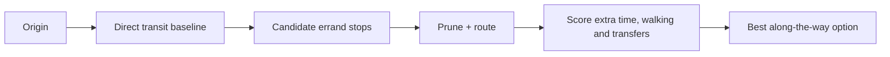

# Along

**Journey-aware errand planning for Singapore public transport.**

Along helps you fit one or two errands into an existing trip without turning the journey into a large detour. Instead of asking only "what is the nearest shop?", it compares real candidate stops against the direct public-transport route and ranks them by the extra inconvenience they add.

> **Status:** active development. Along currently targets Singapore and is being iterated as a portfolio/personal project.

## Why I built it

A normal maps search can tell you where a shop is, but not whether stopping there actually makes sense **on the way** from A to B.

Along starts with the direct journey as the baseline, then asks a different question:

> Which real stop satisfies the errand with the least additional time, walking and transfer friction?

For example:

```text
From: Punggol MRT
To: Orchard MRT
Need: groceries + pharmacy
```

The request is treated as a routing and ranking problem rather than a nearest-place lookup.



## What it does

- Resolves Singapore locations from station aliases, local entities and OneMap results.
- Handles one or two errands, including same-hub consolidation when both can be completed at one stop.
- Uses a SQLite/FTS5 POI catalog for local place discovery.
- Supports natural-language needs and preferences such as preferred brands, detour limits and walking tolerance.
- Compares candidate routes against the direct A→B public-transport baseline.
- Ranks recommendations using added journey time, walking, transfers, route proximity and user preferences.
- Uses bounded candidate generation, corridor pruning, route-call budgets and caching.
- Can optionally expand discovery through TomTom, Geoapify and web evidence when the local catalog is insufficient.
- Keeps routing and place-provider credentials on the backend.

The core optimiser is deterministic. LLM support is optional and limited to interpreting unfamiliar intent/concepts; it does not invent routes or authoritative place results.

## Recent journey and discovery improvements

The September iteration focused on making recommendations more practical and easier to trust:

- **Leave now / Leave later** planning in Singapore time.
- Arrival-aware **opening-hours warnings**, including explicit unknown-hours states.
- Clear direct-versus-errand journey comparisons.
- **Cancel and retry** without losing the journey request.
- A journey timeline with synchronized **map ↔ stop highlighting**.
- More specific explanations for why a recommendation was chosen.
- Better route-proximity ranking before candidate truncation.
- Related-search suggestions when a discovery request has no suitable result.
- Stricter web grounding so mall coordinates are not treated as verified storefronts.
- Mobile result controls that keep the map usable while browsing details.
- A repeatable six-case offline benchmark for regression checks.

## Stack

| Area | Technology |
| --- | --- |
| Frontend | Next.js 16, React 19, TypeScript, Leaflet |
| Backend | FastAPI, Python, Pydantic, HTTPX |
| Data | SQLite, FTS5, OpenStreetMap-derived POIs, LTA rail gazetteer |
| Routing / geocoding | OneMap provider abstraction with deterministic mock mode |
| Optional discovery | TomTom, Geoapify, Tavily |
| Testing | Pytest, Playwright |

## Architecture

```text
Next.js client
    │
    ▼
FastAPI
    ├── Location resolver ── LTA gazetteer / local entities / OneMap
    ├── Need resolver ────── concepts / SQLite FTS5 / optional live discovery
    ├── Intent parser ────── deterministic parser / optional LLM fallback
    ├── POI repository ───── SQLite hubs and outlets
    ├── Optimiser ────────── candidate generation → pruning → routing → scoring
    └── Analytics ────────── allowlisted anonymous beta events
```

More detail is in [`docs/architecture.md`](docs/architecture.md).

## Optimisation approach

For each request, Along:

1. Resolves the origin and destination.
2. Computes the direct public-transport route as the baseline.
3. Finds hubs or places that can satisfy the requested errands.
4. Uses route-corridor geometry to favour candidates that are actually along the journey.
5. Prunes poor candidates before making expensive routing calls.
6. Routes the remaining A→stop→B or A→stop1→stop2→B options.
7. Calculates incremental time, walking and transfers relative to the direct journey.
8. Applies hard requirements and preference-aware scoring.
9. Returns the least disruptive recommendation together with practical context, warnings and alternatives.

For two errands, the optimiser evaluates consolidated stops and both travel orders where separate stops are required.

## Repository map

```text
backend/
  app/                 FastAPI app, providers, resolvers and optimiser
  data/                local discovery/evaluation data and Singapore POI inputs
  fixtures/            deterministic and sanitized routing fixtures
  scripts/             ingestion, diagnostics and validation utilities
  tests/               backend unit, regression and integration tests
  tools/               discovery and journey benchmark tooling

frontend/
  app/                 Next.js planner UI
  e2e/                 Playwright browser tests and visual review flows

docs/                  architecture, routing contracts, QA and design notes
```

## Validation

The September integration was checked with:

- **206 backend tests passed**
- **4 explicitly gated integration tests skipped by default**
- **32 browser tests passed** across mobile and desktop
- frontend ESLint, TypeScript checks and production build passed
- repository/source credential scan passed
- six-case offline benchmark and repeatability regression passed

The offline benchmark is a regression tool, not a claim of real-world recommendation accuracy. Live/manual relevance review remains an ongoing quality task.

## Security and privacy

- `.env`, frontend environment overrides, local runtime databases, virtual environments, build output and test artefacts are ignored by Git.
- Provider credentials remain backend-only.
- OneMap authentication tokens are cached in backend memory rather than exposed to the browser.
- Beta analytics use an allowlisted schema and do not accept exact coordinates or free-form journey text.
- Retained provider fixtures are sanitized before publication.

## Data

The project uses a Singapore OpenStreetMap-derived POI capture with source metadata and ODbL attribution, together with a local LTA rail gazetteer and deterministic seed data for repeatable development/testing.

See [`backend/data/README.md`](backend/data/README.md) for the data and licensing boundary.

## Current limitations

- Singapore only.
- No public hosted demo yet.
- Real routing quality and availability depend on OneMap.
- Place coverage is not a guaranteed real-time business directory.
- Opening hours, product stock and business availability may be incomplete or unknown.
- No turn-by-turn navigation; selected stops hand off to an external navigation app.
- The project is designed for personal/beta-scale use rather than high-traffic production infrastructure.

## Development history

Along has been built iteratively from baseline routing through multi-stop optimisation, POI discovery, intent parsing, open-world place discovery and journey-aware recovery/UX improvements.

A concise release history is kept in [`CHANGELOG.md`](CHANGELOG.md).
