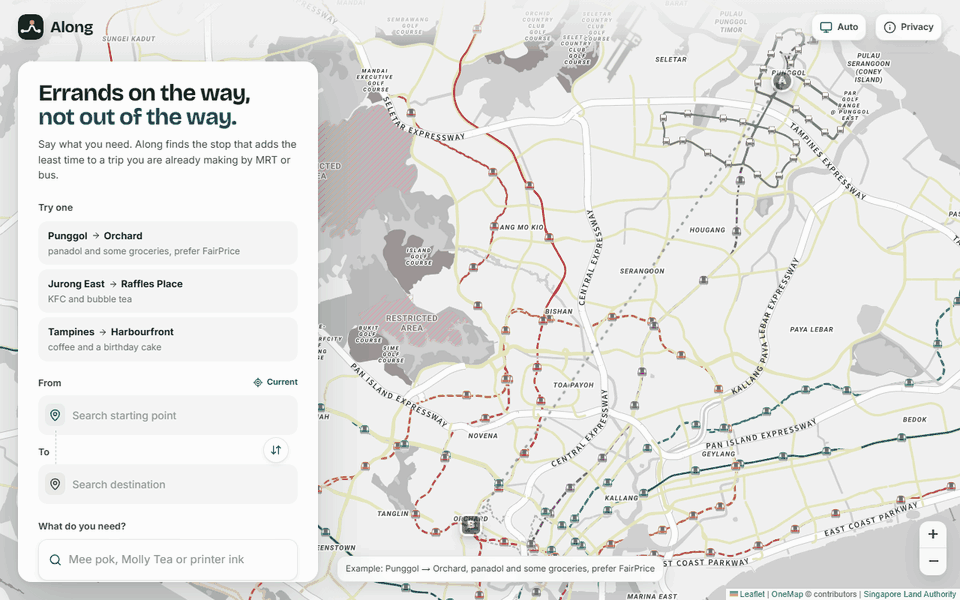
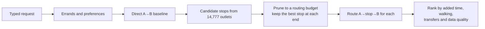
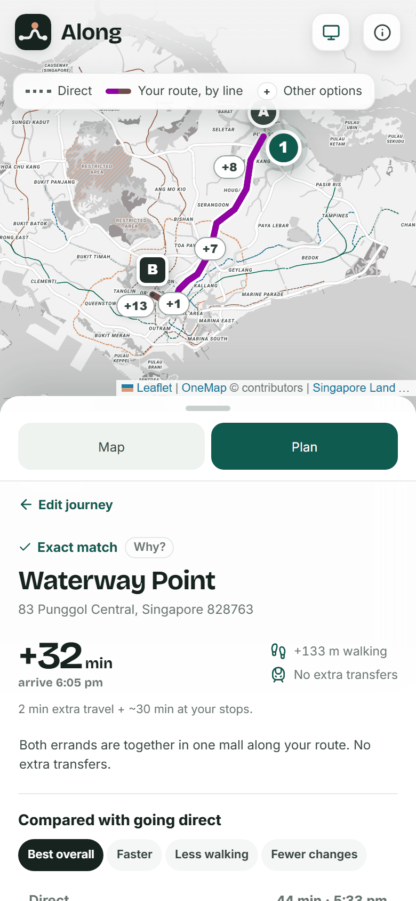
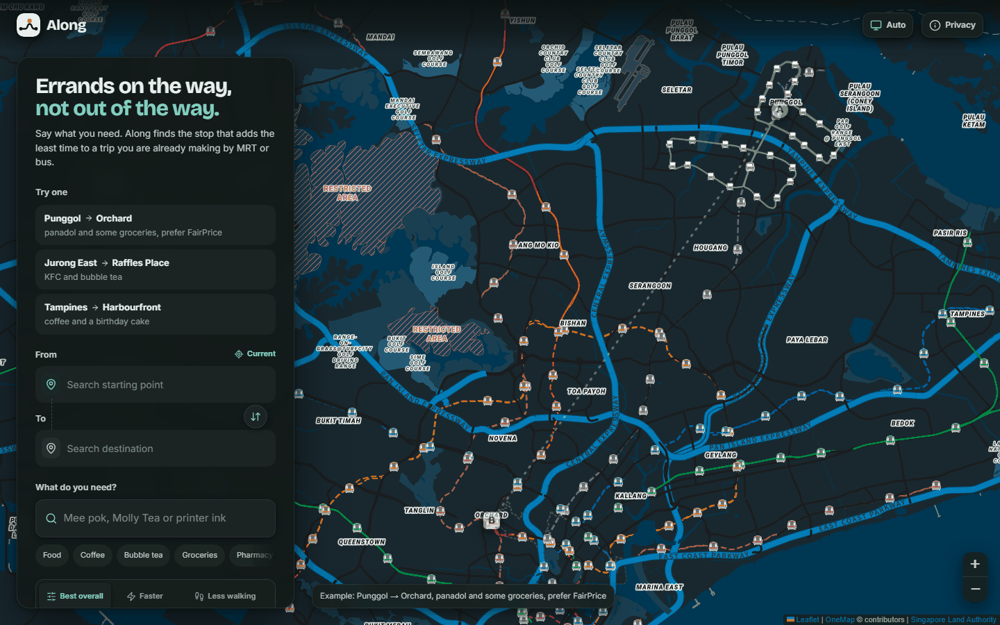

# Along

**Errands on the way, not out of the way — journey-aware errand planning for Singapore public transport.**



You're going from Punggol to Orchard and need panadol and groceries. A maps search shows you
the nearest pharmacy. Along answers a different question: **which real stop gets both errands
done for the least added time, walking and train changes, measured against the trip you were
already making?** Here it picks Waterway Point, a two-minute walk from where you start: 2 extra
minutes of travel plus the time in the shops, on the North East Line you were going to ride
anyway.

## Who it's for

People in Singapore who get around by MRT and bus and fit errands into trips they're already
making: after work, before dinner, on the way to someone's place. It isn't trying to replace
Google Maps' "search along route". That feature finds places near a road. Along prices each
candidate stop as a full public-transport journey (walk, train, change, walk) and compares it
with going direct.

## How it decides


```mermaid
flowchart LR
    A[Typed request] --> B[Errands and preferences]
    B --> C[Direct A→B baseline]
    C --> D[Candidate stops from 14,777 outlets]
    D --> E[Prune to a routing budget<br/>keep the best stop at each end]
    E --> F[Route A→stop→B for each]
    F --> G[Rank by added time, walking,<br/>transfers and data quality]
```

1. **Read the request.** "need to grab panadol and some groceries, prefer FairPrice, don't want
   to walk much" becomes two errands (pharmacy, groceries), a brand preference and a walking
   preference. A deterministic parser handles this; an LLM fallback is optional and can never
   name a place.
2. **Price the direct trip first.** Every option is scored against this baseline, not in
   isolation.
3. **Find candidates, then prune before routing.** Hundreds of malls and shops can satisfy
   "groceries". Routing calls are budgeted, so candidates are pruned by how far they sit from
   the baseline route, and the best stop beside the origin and the destination is always kept.
   That obvious answer used to be pruned away.
4. **Route each survivor** as A→stop→B, or A→stop₁→stop₂→B in both orders for two errands.
5. **Rank** by extra minutes, extra walking and extra transfers, with preferences as weights
   and "must be KFC"-style requirements as hard constraints. Time in the shop is shown but kept
   separate, since it's about the same whichever stop you pick.

Design notes and trade-offs: [`docs/case-study.md`](docs/case-study.md). The full system:
[`docs/architecture.md`](docs/architecture.md).

<p>
  
  
</p>

## Measured, not claimed

| What | Result |
| --- | --- |
| Request parsing: 60 everyday phrasings | 99% correct (was 74%) |
| …and 20 written afterwards, never tuned against | 95% correct (was 70%) |
| Backend tests | 367 passed |
| Browser tests, API stubbed: 4 viewports × light/dark | 164 passed |
| Browser tests against the real API and production build | 10 passed |
| Six-journey offline optimiser benchmark | repeatable; regression tool only |

The phrasing set is [`backend/data/phrasing-evaluation.json`](backend/data/phrasing-evaluation.json),
scored by `backend/tools/evaluate_phrasings.py`. CI fails if it drops below 90%. The one held-out
miss ("good morning" accepted as an errand) is left in on purpose so the number stays honest.
None of this is a claim about real-world recommendation quality, which depends on live OneMap
routing and how complete the place data is.

## Run it

Everything runs offline by default: no keys, no accounts.

```powershell
# backend: FastAPI on :8000
cd backend
python -m venv .venv
.\.venv\Scripts\python.exe -m pip install -r requirements-dev.txt
.\.venv\Scripts\python.exe scripts\ingest_osm_pois.py --input data\singapore-osm-pois.json
.\.venv\Scripts\python.exe -m uvicorn app.main:app --port 8000

# frontend: Next.js on :3000
cd frontend
npm ci
npm run dev
```

Building the catalog takes about 10 seconds and gives 14,777 outlets across 26 categories. Without it
the app boots on a 30-outlet seed, which is enough for tests but not for judging a
recommendation. `Dockerfile` and `render.yaml` build a single production container in which
FastAPI serves the static frontend.

**Mock mode is a real network with estimated times.** With `ONEMAP_MOCK=true` (the default),
routes are computed over Singapore's actual rail network, built from LTA's station codes: real
lines, real interchanges, real stop counts, the Changi Airport shuttle, the LRT loops. Only the
minutes are estimates. Long walks to a station become an unnamed "feeder bus (sample routing)"
instead of an invented service number. Set OneMap credentials and `ONEMAP_MOCK=false` for live
routing; `LTA_ACCOUNT_KEY` with `DATAMALL_MOCK=false` adds live bus arrivals.
[`.env.example`](.env.example) documents every setting.

### Checks

```powershell
cd backend;  .\.venv\Scripts\python.exe -m pytest -q
cd backend;  .\.venv\Scripts\python.exe tools\evaluate_phrasings.py --min-pass 0.9
cd frontend; npx tsc --noEmit; npm run lint; npm run test:e2e; npm run test:e2e:real
```

## Stack

| Area | Technology |
| --- | --- |
| Frontend | Next.js 16 (static export), React 19, TypeScript, Leaflet |
| Backend | FastAPI, Pydantic, HTTPX |
| Data | SQLite + FTS5, OpenStreetMap-derived POIs (ODbL), LTA rail gazetteer |
| Routing / geocoding | OneMap, behind a provider interface with an offline rail-network mock |
| Optional | LTA DataMall bus arrivals; TomTom, Geoapify, Tavily discovery; OpenAI intent fallback |
| Testing | Pytest, Playwright, phrasing evaluation, offline optimiser benchmark |

```text
backend/app/
  main.py          app wiring only
  api/             HTTP routes by area: places, journeys, intent, admin
  services/        parser, discovery, candidate pruning, optimiser
  providers/       OneMap, the offline rail-network mock, DataMall, place search
frontend/app/
  page.tsx         the planner
  components/      map, location fields, result panel; journey/ holds its parts
  e2e/, e2e-real/  stubbed and full-stack browser suites
```

## Privacy and security

- Provider credentials and OneMap tokens stay on the backend; the browser never sees them.
- Internal diagnostics (candidate counts, cache hits, LLM tokens and cost) leave the API only
  when `EXPOSE_DIAGNOSTICS=true`.
- Beta analytics accept an allowlisted schema: no coordinates, no free-text journeys.
- See [`docs/privacy.md`](docs/privacy.md).

## Limitations

- Singapore only, public transport only, one or two errands.
- Opening hours are published for about 20% of outlets; the rest show as unknown rather than
  guessed. Stock is never claimed.
- Offline, postal codes resolve from the roughly 2,100 the catalog's addresses contain, and
  otherwise to the middle of their postal sector, labelled approximate. OneMap resolves every one.
- No turn-by-turn navigation: a chosen stop hands off to a maps app.
- Built for personal and beta-scale use, not high traffic.

Release history: [`CHANGELOG.md`](CHANGELOG.md). Map data © OpenStreetMap contributors (ODbL);
basemap © OneMap / Singapore Land Authority.
