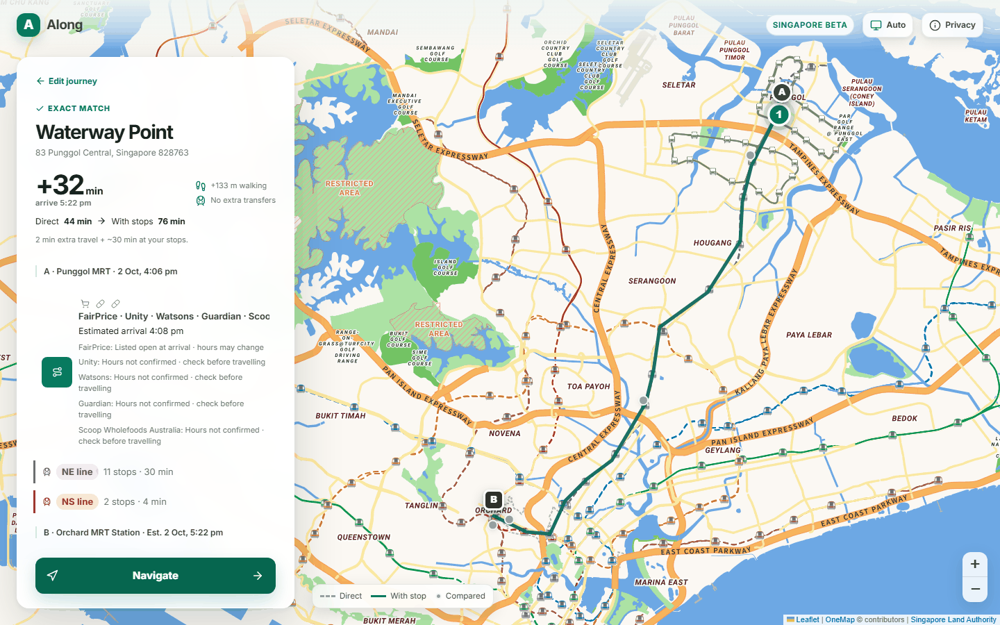
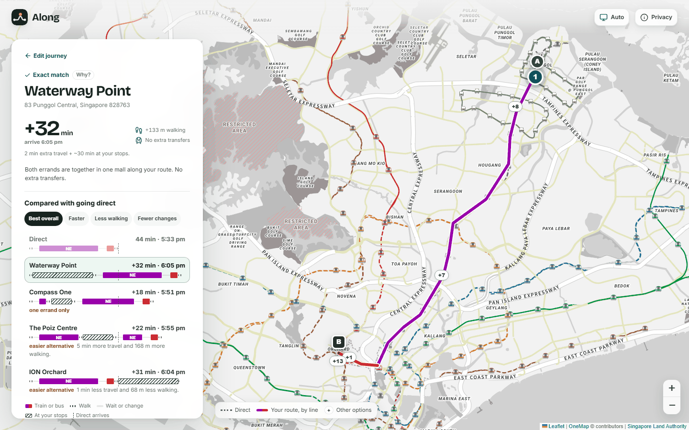

# Along: case study

## The problem

Errands get planned around the shop, not around the trip. A maps search answers "where is
the nearest pharmacy?". Someone riding from Punggol to Orchard actually wants to know "where
can I get panadol and groceries **without making this trip much longer**?" The nearest shop
to where you are now is often the wrong answer. The right one is usually beside a station
you were going to pass, or at either end of the trip.

## The product decision

Treat it as a routing problem with a baseline, not a search problem:

- **The direct trip is the yardstick.** Every option is priced as *added* minutes, walking
  and train changes relative to going direct, because that's the cost the traveller feels.
- **The headline is the time you lose.** An earlier version led with "+6 min extra travel"
  and put the 30 minutes in shops in small print. Now the headline is the total added time and
  the arrival, with travel and time at the stops broken out underneath. Extra travel stays
  visible there because it's what differs between options.
- **Being honest beats looking complete.** Opening hours exist for about 20% of outlets; the
  rest say "hours not confirmed" rather than guessing. Bus times without a live key are
  labelled samples. Mock routing never invents a bus number.

## Engineering decisions and trade-offs

**A routing budget, and what it nearly cost.** Routing every candidate would mean hundreds of
OneMap calls per request. Candidates are pruned before routing, using a cheap proxy (distance
from the baseline route plus the walk to transit). The proxy has a blind spot: a mall 400 m
from the origin scores worse than malls sitting right on the line, so Waterway Point, beside
Punggol MRT, was never routed for a Punggol trip. The fix keeps the proxy but always routes the
best stop beside each end of the trip. A test seeds eight on-line malls plus one beside the
origin and asserts that one ranks in the top two. It fails without the fix.

**A mock that tells the truth.** The demo runs without OneMap credentials, so the mock *is* the
product for most people who look at it. It used to name a line by hashing the trip distance,
so Punggol "boarded the NS line". It now runs Dijkstra over a graph built from LTA's own
station codes. Consecutive codes are neighbours, codes shared by one station are interchanges,
and the few links the numbering doesn't express are listed by hand: the Marina Bay spur, the
Changi Airport shuttle, the LRT loops. Lines, interchanges and stop counts are real; only the
minutes are estimates.

**Parsing everyday language without an LLM.** A deterministic parser maps phrases and brands to
categories, and a clause splitter catches needs the taxonomy doesn't know (open discovery).
Real phrasing broke the hand-off: "need to grab panadol and some groceries, prefer FairPrice"
split into three "needs", and because there were more clauses than parsed errands the good
parse was thrown away. Fixes: strip filler words, treat preference clauses as preferences, turn
away greetings, and only fall back to discovery when a clause is one the parser didn't
understand. Measured on 60 tuned phrasings and 20 held-out ones: 74% → 99% and 70% → 95%.

**Errors that belong to the user.** An unknown place used to be an HTTP 502, which says the
server broke. It's a 422 now, with a "did you mean" built from the station gazetteer, and
postal codes resolve offline from catalog addresses.

## Designing the comparison

A design review asked a blunt question: what on screen is only true of this product? The
answer was nothing. The layout was the default map-app template (a floating card over a full
map, one green accent, small uppercase labels, a three-line tagline, a lettermark logo, a beta
pill), and the product's one idea appeared as three lines of text that said the same thing
three ways: "+32 min", "Direct 44 min → With stops 76 min", "2 min extra travel + ~30 min at
your stops". The comparison behind it, every option that was routed, sat in two collapsed
lists under the Navigate button.

| Before | After |
| --- | --- |
|  |  |

**The detour diagram.** I considered three ways to draw it:

- A bar chart of added minutes per option. It's honest, but it loses *why*: two options at +30
  can be very different trips.
- A scatter of added time against walking. It's good for an analyst, but it's unreadable at
  phone width.
- Each option drawn as its own journey on a shared time axis. This is the one I chose. Rides
  are in their MRT line's colour, and the time in shops is hatched. The direct trip is the
  first row, with a dashed "direct arrives" line through every row.

The third answers the questions the other two can't. Why is +2 min of travel +32 min late?
The hatched block shows the shopping time. Why is a +18 option not the pick? Its row says
"one errand only". Where is the shopping? At the start, beside the station, because the
hatching sits before the purple North East Line ride. It reuses the colour system every
Singaporean already reads, and it needs no legend beyond five swatches.

**Every number checks against its neighbours.** The old timeline printed the departure, one
stop's arrival and the final arrival, and left the rest of the hour unexplained. The new one
is built only from the router's own times and the gaps between them. A full-stack test walks
the clock column and asserts it never runs backwards and ends at the headline's arrival time.

**The map stops competing with the route.** OneMap's Default basemap draws every line,
expressway and golf course in saturated colour, and the route (one dark-green line) vanished
beside the East West Line. Grey keeps the stations and line colours and mutes the rest. The
route is now drawn leg by leg in its line's colour over a white casing, which needed a small
API change: each leg now carries its own geometry. Compared places are pins with their extra
minutes instead of anonymous dots.

**A first visitor has somewhere to start.** A reviewer who doesn't know Singapore had nothing
to type. Three example journeys, each checked against the offline catalog, run a real plan in
one tap.

Smaller fixes came out of looking at every state at three widths:

- The phone's map attribution was pinned to a fixed height and covered the address.
- The tablet used the stretched phone layout.
- Error notices opened below the fold.
- Sorting the combined option list by score put an "easier alternative" above the app's
  actual pick.

## How it's verified

- 370 backend tests, including the network-mock, parser, error-code and ranking cases above.
- A phrasing evaluation that CI fails below 90%.
- 164 browser tests with the API stubbed (phone and desktop, light and dark), and 14 that run
  the real API serving the production build, so the client and the API can't drift apart
  unnoticed.

## What I'd do next

- Host the demo (the container and `render.yaml` are ready) and record a handful of live
  OneMap journeys, so live and mock can be compared side by side.
- Split `page.tsx`. The planner's state lives in one large component, and separating it is a
  redesign rather than a file move.
- A "why not X?" answer for when a traveller expects a place the ranking passed over.
